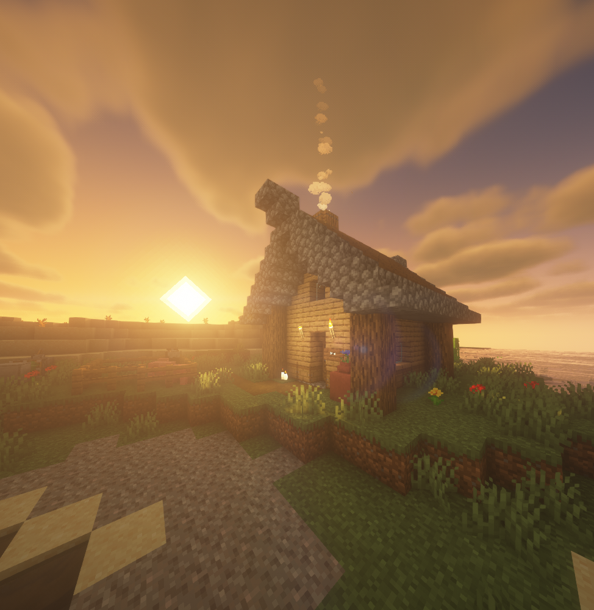

    

<h3><u>RealmProtection</u></h3>

RealmProtection is a Minecraft plugin that allows you to claim a 16x16 block segment from a world (a chunk) and protects it from griefers and thieves. It is customizable, roles-based for land members, and has 30+ flags for each role. This plugin uses SQLite as the main database and has a powerful cache system to avoid the database being locked every time.

 
 

## How to install

Go to the [releases section](https://github.com/TFAGaming/RealmProtector/releases), scroll down to find the version you want to use, click on **Assets** and then click on the **.jar** file to download.

Once the download is finished, copy the **.jar** file, open the plugins folder from your Minecraft server directory, and paste it there. If your Minecraft server is running, you can use the command `/reload` to get the plugin ready for the server, but we recommend you stop the server and then start it again for a fresh startup.

## How does it work?
Once you try to claim a chunk, the plugin will ask you to enter a new land name with the command arguments. This will make the plugin create a new land with its specific name and ID, and protect the chunk that the player (you) is standing in. When new land is created, there will be two default roles to maintain the land; The first one is the Visitor role, which has nearly every flag disabled by default. The role is given by default to any non-trusted player in the land. The second role is the Member, which has nearly every flag enabled by default. These two roles are uneditable, which means they cannot be deleted or renamed because they're plugin-based roles. You can create other roles, but these two specific roles cannot be changed.

If you try to invite a player to the land, you have to give the player a role to join. Note that if the Visitor role has a flag enabled and the role that the trusted player got has the same flag but is disabled, the player won't have permission to use that flag in the land.

## Commands
The main command for the plugin is `/land`, aliases: `/lands`.

### Sub-commands:
- `/land claim {name}`: Creates a new land (if the player doesn't have one) and protects the chunk that the player is on it.
- `/land unclaim [confirm]`: Unclaims the chunk that the player is on it, deletes the land if there are no chunks to maintain it.
- `/land roles [create/delete/rename/flags]`: The main roles manager command:
    - `/land roles create [role name]`: Creates a new role with a unique ID for the land, has nearly every flag enabled.
    - `/land roles delete [role name]`: Deletes an existing role from the land.
    - `/land roles rename [old name] [new name]`: Renames a role's name.
    - `/land roles flags [role role] (flag) (true/false)`:
        - If the argument **flag** is undefined, it will show a GUI of enabled and disabled flags for the role.
        - If the argument **flag** is not undefined, it will update the role flag's value from the second argument **true/false**.
- `/land nature flags (flag) (true/false)`:
    - If the argument **flag** is undefined, it will show a GUI of enabled and disabled flags for the land's nature.
    - If the argument **flag** is not undefined, it will update the flag's value from the second argument **true/false**.
- `/land spawn [land name]`: Teleports a player to a land, only if the player has the flag **teleporttospawn** enabled or the player is the owner of the land.
- `/land setspawn`: Updates the spawn point of the land with the coordinates of the player's current position.
- `/land info (land name)`: Opens a GUI of land information; Number of chunks, ID, Owner, Members and their roles... etc.
- `/land view`: Spawns colored particles around the claimed chunks of the land, without the need of **F3 + G** Minecraft hotkey.
    - If the particles' colors are **Green**, it means you are the owner of the land and you have every permission to modify and update land's data.
    - If the particles' colors are **Yellow**, it means you are trusted in the land but you do not have the enough power to be like the land's owner.
    - If the particles' colors are **Red**, it means you are not trusted in the land and you are marked as a Visitor.
- `/land deposit [amount]`: Deposit an amount of money to the land's bank system.
- `/land withdraw [amount]`: Withdraw an amount of money from the land's bank system.
- `/land balance`: View the land's balance (bank).
- `/land trust [player name] [role name]`: Trust a player to your land, and let that player to be a member in your land with a specific role.
- `/land untrust [player name]`: Untrust a player from your land.
- `/land leave [land name]`: Leave a land that you are trusted in.
- `/land delete [confirm]`: Deletes the land; Deletes every role, removes every trusted member and unclaims every claimed chunk (for the land).

### Arguments:
- `{arg}`: An argument that could be required or optional.
- `(arg)`: An optional argument.
- `[arg]`: A required argument.

## License
The [**Apache-2.0**](./LICENSE) license.