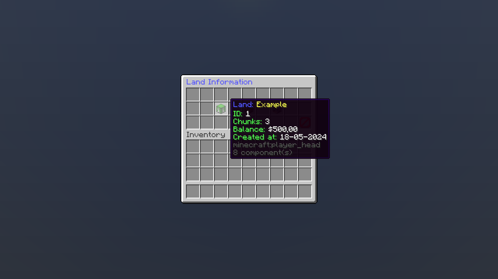
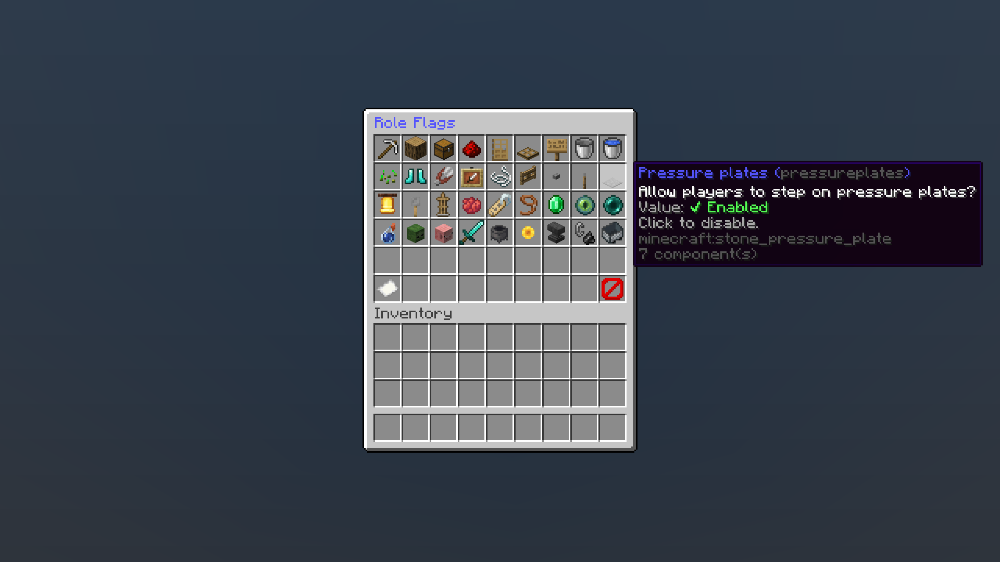
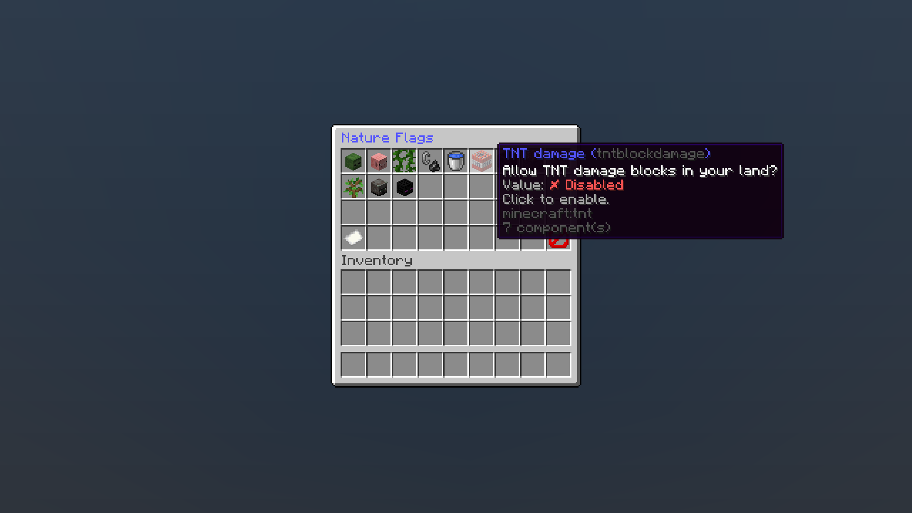
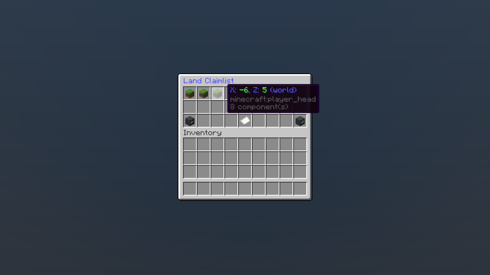

    

<h3><u>RealmProtection</u></h3>

RealmProtection is a Minecraft plugin allowing players to own a 16x16 block chunk within a world and safeguard it against griefers and thieves. Highly customizable, it operates on a role-based system for land members, offering over **36** flags per role. Utilizing SQLite as its primary database, this plugin incorporates a robust cache system to prevent frequent database locks.

 

**Native Minecraft version:** 1.20.6  
**Tested Minecraft versions:** 1.18, 1.19, 1.20, 1.20.6

## Features
- **User-Friendly and Open-Source:** Enjoy the simplicity and freedom of RealmProtection, which is both easy to use and open-source.
- **Extensive Flags:** With over **36** role flags and **10** land natural flags, customize the experience for your land members and visitors!
- **Comprehensive Chunk Protection:** Safeguard your claimed chunks from various threats, including:
  - **Environmental Hazards:** Prevent lavacasts and mitigate damage from explosions caused by TNT, creepers, respawn anchors, end crystals, and beds (in Nether/End).
  - **Player Actions:** Shield against PvP encounters with restrictions on weapons, arrows, splash and lingering potions. Also, block wilderness pistons and dispensers.
  - **Interactions:** Control interactions with items such as item frames, armor stands, flower pots, doors, trapdoors, fence gates, redstone components, lecterns, signs, and more!
  - **Building and Breaking Blocks:** Manage construction and destruction activities within your protected areas.
  - **Container Access:** Regulate access to containers for added security.
  - **Vehicle Usage:** Control the use, spawning, and riding of vehicles.
  - **Entity Protection:** Prevent damage to hostile and passive entities, ensuring their safety.
- **Customizable Configuration:** Customize the plugin to your server's needs with a flexible configuration system, allowing you to fine-tune every aspect of chunk protection.
- **Efficient Performance:** RealmProtection has a powerful database manager with a built-in cache to keep the server and the plugin performant.
- **Integration with External Plugins APIs:** Seamlessly integrate with external plugins APIs including [VaultAPI](https://github.com/MilkBowl/VaultAPI) and [LuckPerms](https://github.com/LuckPerms/LuckPerms) for enhanced functionality and compatibility.

    
Screenshots (Click here)

    <h3>Land information GUI:</h3>
    
    <h3>Role flags GUI:</h3>
      
    <h3>Nature flags GUI:</h3>
    
    <h3>Land claimlist:</h3>
    
    <h3>Land border (green particles):</h3>
    

## How to install

Go to the [releases section](https://github.com/TFAGaming/RealmProtector/releases), scroll down to find the version you want to use, click on **Assets** and then click on the **.jar** file to download.

<!--  -->

After the download completes, simply copy the **.jar** file and navigate to the plugins folder within your Minecraft server directory, and paste the file there. If your Minecraft server is currently running, you can execute the command `/reload` to activate the plugin. However, for optimal performance, we advise stopping the server and then restarting it for a clean startup.

For your Minecraft server setup, we recommend utilizing [PaperMC](https://papermc.io/) due to its superior performance and optimization compared to [Spigot](https://www.spigotmc.org/).

> [!WARNING]  
> You must install the plugins from the list below to make the plugin fully functional:
> - [Vault](https://github.com/milkbowl/Vault) ([SpigotMC ↗](https://www.spigotmc.org/resources/vault.34315/))
> - [Essentials](https://github.com/EssentialsX/Essentials) ([SpigotMC ↗](https://www.spigotmc.org/resources/essentialsx.9089/))
> - [LuckPerms](https://github.com/LuckPerms/LuckPerms) ([SpigotMC ↗](https://spigotmc.org/resources/luckperms.28140/))
>
> [Click here](#why-essentials-vault-and-luckperms-are-required) to understand why you must install these plugins on your server.

## Commands
The primary command for the plugin is `/land`, which also accepts the alias `/lands`. This choice was made to provide a convenient and easily memorable command, considering that `/realmprotection` might be hard due to its length.

### Sub-commands:

- `/land accept [land name]`: Accepts a land invite.
- `/land balance (land name)`: Checks a land's bank balance.
- `/land ban [player name] (reason)`: Bans a player from entering a land.
- `/land banlist`: Lists banned players from a land.
- `/land claim {name}`: Creates a new land and protects the chunk the player is standing on.
- `/land claimlist`: Opens a pagination GUI with a list of claimed chunks for a land.
- `/land delete [confirm]`: Deletes a land, removing roles, trusted members, and claimed chunks.
- `/land deposit [amount]`: Deposits money into a land's bank.
- `/land fly`: Toggles fly mode in owned land chunks.
- `/land info {land name}`: Displays information about a land.
- `/land invites`: Lists pending land invites.
- `/land leave [land name]`: Leaves a land without owner actions.
- `/land nature flags (flag) {true/false}`: Manages land nature flags.
- `/land rename [new name]`: Renames a land.
- `/land roles [create/delete/rename/flags]`: Manages land roles:
    - `/land roles create [role name]`: Creates a new role with default permissions.
    - `/land roles delete [role name]`: Deletes an existing role.
    - `/land roles flags [role name] (flag) {true/false}`: Manages role flags.
    - `/land roles rename [old name] [new name]`: Renames a role.
- `/land setspawn`: Sets a land's spawn point to the player's current position.
- `/land spawn [land name]`: Teleports to a land's spawn point.
- `/land storage`: Opens a large inventory acting like an Ender chest.
- `/land top`: Returns a list of the top 10 lands with the highest bank balance in the economy.
- `/land trust [player name] [role name]`: Invites a player to join a land.
- `/land unban [player name]`: Unbans a player from a land.
- `/land unclaim [confirm]`: Unclaims the chunk the player is standing on and deletes the land if no chunks remain.
- `/land untrust [player name]`: Removes a player's trust from a land, might revoke an invite if the player is invited.
- `/land view`: Visualizes claimed chunks of a land with [colored particles](#what-does-it-mean-for-each-color-particle-around-a-land).
- `/land withdraw [amount]`: Withdraws money from a land's bank.

### Arguments:
- `{arg}`: Optional argument (must be provided if indicated).
- `(arg)`: Optional argument.
- `[arg]`: Required argument.

## Known bugs

You can [contribute](#contributing) if you have a solution for one of the bugs below!

- **1.20.6^**:
    - Any player can break wolf armor in claimed chunks.

## Frequently Asked Questions (FAQs)

### Why Essentials, Vault and LuckPerms are required?

To ensure seamless functionality, RealmProtection requires integration with three essential plugins on your server:

- **Essentials** and **Vault**: Integration with the economy system.
- **LuckPerms**: Utilization of group management and permission features.

### How do the command permissions work?

Each command within the plugin is associated with its specific permission node, beginning with `realmprotection.lands.(command)`. By default, all permissions are granted to everyone, allowing universal access to the commands. However, for finer control over command usage, you can use the LuckPerms plugin to customize permissions for each command according to the designated player groups.

> [!CAUTION]  
> The permission `realmprotection.lands.__operator__` grants extensive privileges that can pose significant risks if granted to ordinary players. These privileges include the ability to bypass disabled flags in any land and claim territory adjacent to existing lands.
>
> To mitigate potential risks, it's advisable to reserve this permission for player groups with elevated trust levels on the server, such as **Administrators** or **Owners**. By default, this permission is restricted to server operators only.

### What's the difference between Role flag and Nature flag?

A role flag refers to a permission that can be either allowed or disallowed for a specific land role. On the other hand, a nature flag refers a feature or protection for a land that is either allowed or disallowed and remains undetectable when a player performs it. Examples of nature flags include features like wilderness pistons, which are undetectable when activated by a player, and protections like mob spawners, which are natural from the environment.

### Why must every player claim one chunk away from any land?

To prevent neighboring claims and maintain adequate space between them. This feature is built-in to the plugin and cannot be disabled. It ensures that players cannot bypass some natural flags by claiming land directly adjacent to another claimed chunk.

### What does it mean for each color particle around a land?

- **Red color**: Indicates that you are not trusted in the land, and you are marked as a visitor.
- **Yellow color**: Indicates that you are trusted in the land but with certain restrictions imposed by role flags.
- **Green color**: Indicates that you are the owner of the land.

## Report a bug
Navigate to the [issues](https://github.com/TFAGaming/RealmProtection/issues) section and initiate a new issue. Kindly ensure to include detailed steps to reproduce the bug and, if possible, propose a small fix as a solution.

## Contributing
Feel free to fork the repository and submit a new pull request if you wish to contribute to this project.

Before you submit a pull request, ensure you tested it and have no issues. Also, keep the same coding style, which means don't use many unnecessary spaces or tabs.

## License
The [**Apache-2.0**](./LICENSE) license.